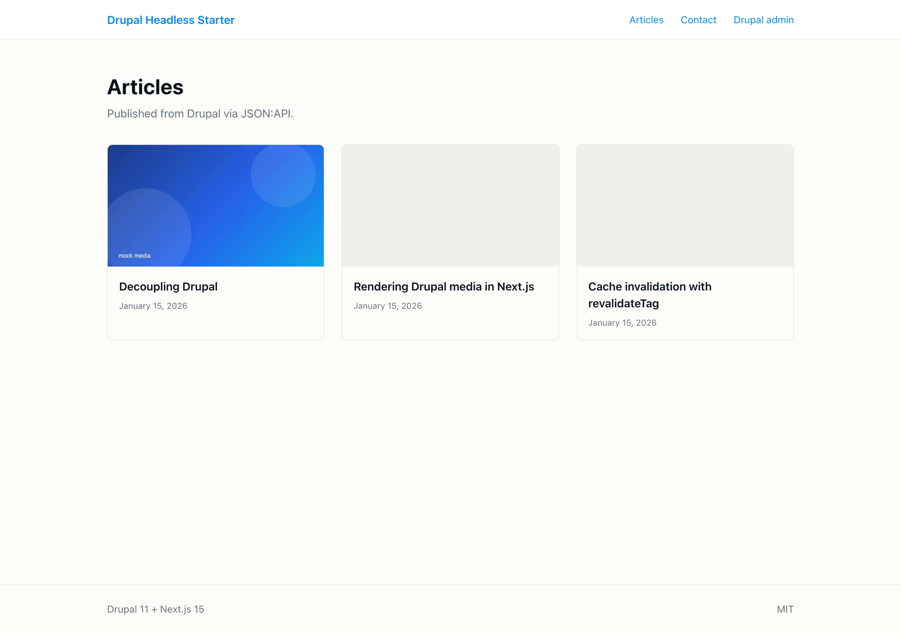
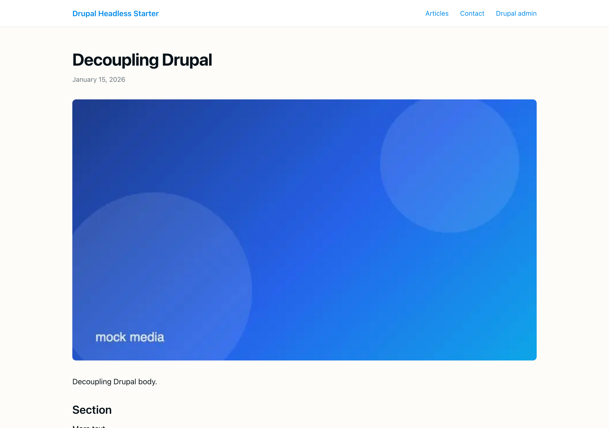
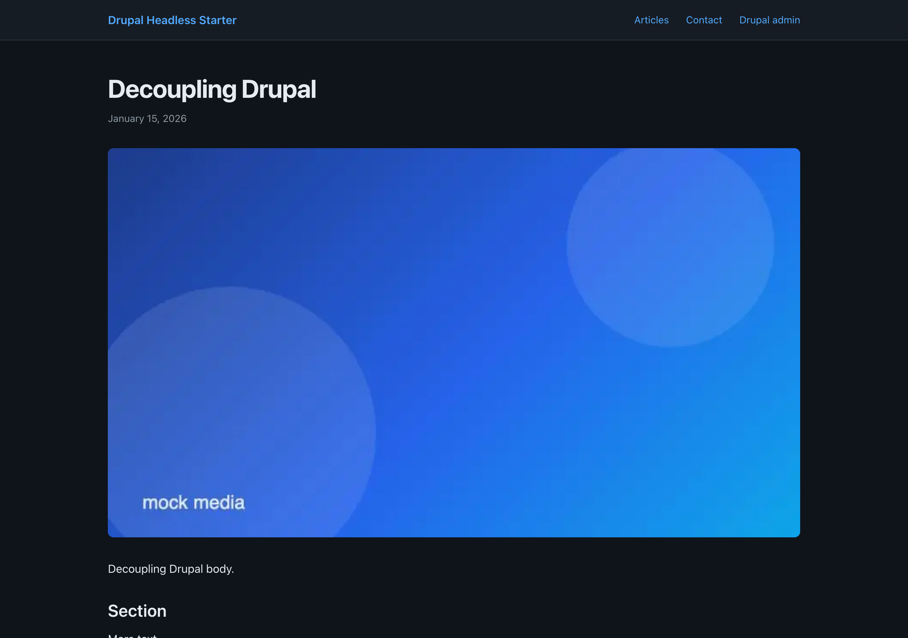
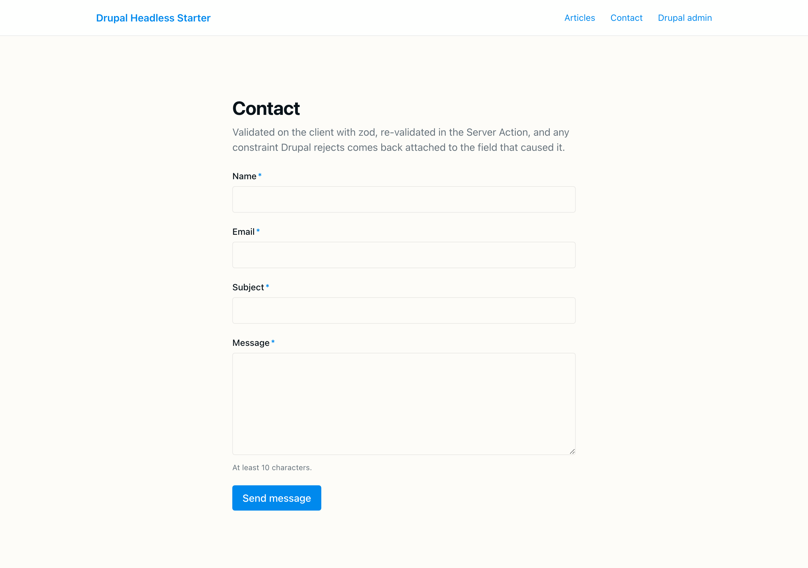
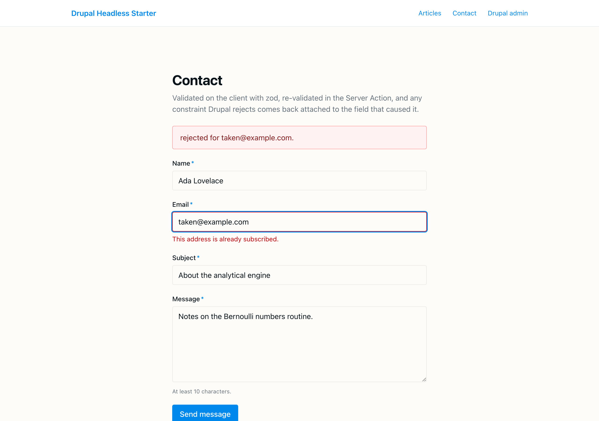

# Drupal Headless Starter

A production-shaped Drupal 11 + Next.js 15 starter where the interesting half
is handled: editorial preview, tag-based cache invalidation, and a write path
where Drupal gets to reject the submission and the user is told which field it
objected to.

[](https://github.com/mykolapodpriatov/drupal-headless-starter/actions/workflows/ci-frontend.yml)
[](https://github.com/mykolapodpriatov/drupal-headless-starter/actions/workflows/ci-drupal.yml)
[](https://mykolapodpriatov.github.io/drupal-headless-starter/)
[](LICENSE)

## Demos

| | What it shows | Why there |
|---|---|---|
| **[Component demo →](https://mykolapodpriatov.github.io/drupal-headless-starter/)** | Storybook: every component in every state, on mocked Drupal data — including states you cannot reach in a running app (the draft-preview banner, a Drupal 422 landing on a field, markup the sanitiser strips) | GitHub Pages serves static files |
| **Full app** — [](https://vercel.com/new/clone?repository-url=https%3A%2F%2Fgithub.com%2Fmykolapodpriatov%2Fdrupal-headless-starter&project-name=drupal-headless-starter&root-directory=frontend) | ISR, draft mode, the revalidation webhook, the contact form's Server Action, live Drupal integration | needs a Node runtime |

**Why the Pages demo is Storybook and not a static export of the app.** It is
not a limitation worked around — it is the honest answer. `output: export`
[does not support Server Actions](https://nextjs.org/docs/app/building-your-application/deploying/static-exports#unsupported-features),
and preview mode, the revalidation webhook and the OAuth callback are all route
handlers. A static export would have to drop the contact form, preview and ISR:
three of the four things this starter exists to demonstrate. A demo that
misrepresents the project is worse than no demo, so the app goes where it can
actually run.



## Why this project exists

Most decoupled-Drupal examples stop at "fetch some nodes and render them." That
part is easy. The parts that decide whether a decoupled stack survives contact
with an editorial team are:

- **an editor can preview an unpublished revision** on the real front end;
- **a publish shows up in seconds**, without a redeploy and without making every
  page stale for a minute;
- **a rejected form submission** comes back attached to the field Drupal
  objected to, not as a generic "something went wrong";
- **Drupal's field names can change** without breaking every component.

This starter implements those four, with the reasoning written down rather than
implied. It is opinionated on purpose — the goal is a working content-driven app
in ten minutes, then peel back the layers.

| | |
|---|---|
|  |  |
| Article page — Drupal's processed body HTML, re-sanitised on this side | The same page in dark mode; the palette is declared once in tokens |
|  |  |
| Contact form — zod on the client, the same schema re-validated server-side | A Drupal 422 landing on the field that caused it, with the unmapped field surfacing as a form-level message |

Screenshots are generated from the running app against the mock backend —
`node scripts/screenshots.mjs`.

## Architecture

```
                    ┌─────────────────────────────────────────┐
                    │       Editors / Content workflow        │
                    └────────────────────┬────────────────────┘
                                         │
                                  edit + preview
                                         │
   ┌─────────────────────────────────────▼─────────────────────────────────┐
   │                          Drupal 11 backend                            │
   │  ┌──────────────┐  ┌──────────────┐  ┌──────────────┐  ┌───────────┐  │
   │  │  JSON:API +  │  │ GraphQL via  │  │ simple_oauth │  │ Recipes + │  │
   │  │ jsonapi_extr.│  │ graphql_comp.│  │  (PKCE/CC)   │  │ config sync│ │
   │  └──────┬───────┘  └──────┬───────┘  └──────┬───────┘  └───────────┘  │
   └─────────┼─────────────────┼─────────────────┼─────────────────────────┘
             │                 │                 │
             ▼                 ▼                 ▼
   ┌────────────────────────────────────────────────────────┐
   │             Next.js 15 frontend (App Router)           │
   │                                                        │
   │  RSC ──▶ src/lib/drupal/client.ts ──▶ JSON:API/GraphQL │
   │  Preview ──▶ /api/preview ──▶ draftMode + redirect     │
   │  Auth ──▶ src/lib/oauth/token.ts (client_credentials)  │
   └────────────────────────────────────────────────────────┘
```

The frontend never talks to Drupal's database directly. Everything goes through
JSON:API (default for content fetching) or GraphQL Compose (for over-fetching-
sensitive views). Auth is OAuth2 — Authorization Code + PKCE for editor preview,
Client Credentials for the server-to-server fetches that power ISR builds.

## Key engineering decisions

### Why Drupal entities are mapped into frontend domain models

JSON:API is a *transport* shape: an image is a pointer into a sibling
`included` array, body text lives at `attributes.body.processed`, and file URLs
arrive site-relative. Consuming that directly means every component knows those
facts, and renaming a field in Drupal — routine, and made easy by
`jsonapi_extras` — breaks every component that touched it.

So there is a seam:

```
Drupal JSON:API → drupalFetch (+ zod) → mapper → domain model → React
```

Nothing above the mapper may reference `attributes`, `relationships` or
`included`; a test asserts the domain model carries none of them. Renaming a
Drupal field changes exactly one file, and components take plain objects — so
unit tests and Storybook share one set of fixtures with no envelope
boilerplate.

The write path follows the same rule. A rejected write returns a JSON:API error
document keyed by Drupal machine names, and
[`lib/drupal/errors.ts`](frontend/src/lib/drupal/errors.ts) translates those
into form fields **through an explicit map** — never by stripping a `field_`
prefix, which would happily attach an error about `field_internal_note` to an
input the user cannot see. Unmapped fields become a form-level message.

Full reasoning and the alternatives considered:
[ADR 001](docs/decisions/001-domain-model-mapping.md).

### Caching: ISR *and* tag invalidation, not one or the other

Time-based revalidation alone means every page is up to a minute stale.
Push-only invalidation means a missed webhook leaves a page wrong forever. Both
are layered: queries carry a 60-second floor plus tags
(`articles:list`, `articles:slug:<alias>`, …), and `POST /api/revalidate` calls
`revalidateTag()` when Drupal publishes. Draft reads bypass both — an editor
must never be served a cached copy of what they are editing.
[ADR 002](docs/decisions/002-caching-and-invalidation.md).

### Streaming is opted into per page, not via `loading.tsx`

A segment-level `loading.tsx` wraps every route below it in Suspense — and once
a response starts streaming, its status code is already on the wire. That made
`notFound()` on `/articles/[slug]` return **HTTP 200 with 404 content**:
invisible in a browser, wrong for crawlers and caches. The article list streams
via an explicit `<Suspense>` where it helps; the detail route awaits and returns
a real 404.

### The error UI never prints `error.message`

A `DrupalApiError` message carries the backend URL and query string; a
validation error can carry payload fragments. `ErrorState` shows a human
sentence and the `digest` Next generates — enough to find the real trace in the
server log. There is a test asserting the internal hostname never reaches the
DOM.

## Performance

- **ISR with tag invalidation** — a publish is visible in seconds; a dropped
  webhook self-heals within 60s. Tags are granular, so editing one article does
  not evict the site.
- **Streaming where it pays** — the article list header flushes before Drupal
  answers; skeletons mirror card geometry so the layout does not shift.
- **Narrow JSON:API field sets** — every query declares `fields[…]` so
  `jsonapi_extras` can trim the payload rather than sending whole entities.
- **In-process OAuth token cache** — one `/oauth/token` round trip per cold
  start, not one per request.
- **Bundle** — the article routes ship ~108 kB of first-load JS; only the
  contact form pulls in a client-side form library.

## Testing

Three layers, each doing something the others cannot
([ADR 003](docs/decisions/003-testing-strategy.md)):

| Layer | Tool | What it covers |
|---|---|---|
| Unit | Vitest (node) | query builder, mappers, Drupal error translation, OAuth/PKCE, sanitiser, env validation |
| Component | Vitest (jsdom) + Testing Library | components against domain fixtures, queried by role and label; **axe-core fails the build on serious/critical violations** |
| End-to-end | Playwright | a production build against a mock Drupal that speaks real JSON:API — OAuth handshake, caching and routing all in the path |

```bash
pnpm test   # 117 unit + component tests
pnpm e2e    # 13 end-to-end specs
```

The E2E suite earned its keep on day one: it found that article detail pages
had never worked against a live backend (a double-applied `/articles/` prefix
between two individually-correct functions) and that `notFound()` was answering
200.

Not covered on purpose: pixel-diff visual regression. Baselines captured on
macOS do not match a Linux runner, and a permanently red check trains people to
ignore CI. It is in the roadmap, to be done in the CI container.

## Accessibility

- `axe-core` runs over every component in the test suite and **fails CI** on
  serious or critical violations — not a panel someone has to remember to open.
  `color-contrast` is excluded there because jsdom has no layout to measure; it
  stays a visual check.
- Form fields get label association, `aria-invalid`, `aria-describedby` and a
  `role="alert"` message wired once in `FormField`, so it cannot be skipped on
  the fourth input.
- Validation moves focus to the first rejected field; a successful submit moves
  focus to the confirmation.
- Loading skeletons are `aria-hidden` — the surrounding region carries
  `aria-busy` / `aria-live`, so a screen reader hears "loading" once, not once
  per card.
- Dark mode follows `prefers-color-scheme`, with colours declared once as
  tokens so no component hard-codes a value.

## Quickstart

Prerequisites: DDEV, Docker, Node 22+, pnpm 10.

```bash
# 1. Boot the full stack (Drupal + Node)
ddev start

# 2. Install Drupal, enable modules, apply the headless_starter recipe,
#    create the Next.js OAuth consumer
ddev exec drupal/scripts/install.sh

# 3. In another terminal, run the Next.js dev server
ddev frontend-dev
```

Drupal is at `https://drupal-headless-starter.ddev.site` (admin / admin).
Next.js is at `http://localhost:3000`.

## Environment variables

| Variable | Used by | Purpose |
|---|---|---|
| `DRUPAL_BASE_URL` | frontend (server) | Internal URL used by RSC fetches |
| `NEXT_PUBLIC_DRUPAL_BASE_URL` | frontend (browser) | Used for image URLs and previews |
| `DRUPAL_CLIENT_ID` | frontend | OAuth consumer ID printed by install.sh |
| `DRUPAL_CLIENT_SECRET` | frontend | OAuth consumer secret |
| `DRUPAL_PREVIEW_SECRET` | both | Shared secret for the preview handshake |
| `NEXT_PUBLIC_FRONTEND_URL` | Drupal | Used for CORS + preview redirects |

These variables are validated at startup by
[`frontend/src/lib/env.ts`](frontend/src/lib/env.ts) with zod. If any are
missing or malformed, the frontend fails fast at boot with an error naming
**every** offending key at once — so a broken `.env.local` or a missing
CI/Vercel var surfaces immediately instead of as a runtime 500 mid-request.

## Auth flow

OAuth2 with `simple_oauth`. Two flows are wired:

1. **Client Credentials** — for ISR builds and server-side fetches. The
   frontend caches the bearer token in-process (see `src/lib/oauth/token.ts`).
2. **Authorization Code + PKCE** — for editors stepping from Drupal admin into
   the Next.js preview surface. The callback lives at `/api/auth/callback`.

Detailed sequence diagrams live in [`docs/auth-flow.md`](docs/auth-flow.md).

## Preview mode

An editor saves a draft in Drupal. Drupal builds a one-time preview URL
containing `secret` + the node UUID and redirects the editor to
`/api/preview?secret=...&slug=...` on Next.js. The route validates the secret,
calls `draftMode().enable()`, then redirects to the article path. Server
Components reading `draftMode().isEnabled` switch their JSON:API queries to
include unpublished content. See [`docs/preview-mode.md`](docs/preview-mode.md).

## Deploy

Drupal and Next.js are deployed independently — see
[`docs/deploy.md`](docs/deploy.md). Short version: Drupal on a PHP host
(Platform.sh, Acquia, Pantheon, or your own), Next.js on Vercel/Netlify with
the OAuth env vars set. The frontend never needs filesystem access to the
Drupal install.

## Security

Before pointing a real domain at the stack, work through the hardening
checklist in [`docs/security.md`](docs/security.md): keeping OAuth/preview
secrets server-side, tightening `simple_oauth` scopes, locking CORS to your
frontend origin, rotating the keys in `drupal/keys/`, and the preview-secret
threat model.

## Docs

- [`docs/architecture.md`](docs/architecture.md) — how the pieces fit together
- [`docs/auth-flow.md`](docs/auth-flow.md) — OAuth sequence diagrams
- [`docs/preview-mode.md`](docs/preview-mode.md) — draft preview handshake
- [`docs/deploy.md`](docs/deploy.md) — independent Drupal + Next.js deploys
- [`docs/security.md`](docs/security.md) — security & hardening checklist
- [`docs/decisions/`](docs/decisions/) — architecture decision records

## Architecture decisions

- [ADR 001 — Drupal entities are mapped into frontend domain models](docs/decisions/001-domain-model-mapping.md)
- [ADR 002 — Caching: ISR plus tag invalidation](docs/decisions/002-caching-and-invalidation.md)
- [ADR 003 — Testing strategy: three layers, no live Drupal in CI](docs/decisions/003-testing-strategy.md)

## Roadmap

Tracked as [open issues](https://github.com/mykolapodpriatov/drupal-headless-starter/issues).
The shortlist:

- Pixel-diff visual regression for Storybook, run inside the CI container
- A nightly integration job against a real DDEV Drupal, off the PR path
- Generate the zod JSON:API schemas from the Drupal schema instead of by hand
- Paginated article listing with cursor-based JSON:API paging
- GraphQL Compose examples alongside the JSON:API ones

## License

MIT — see [`LICENSE`](LICENSE).
